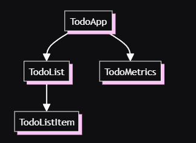

### Composição com Componentes
Componentes são os blocos de construção para criar aplicações em Angular

Componentes te dão estrutura pra organizar seu projeto de um jeito fácil de entender, em partes com responsabilidades claras, o que mantém o código manutenível e escalável.

Aqui um exemplo de como uma aplica;'ao todolist pode ser dividida em uma árvore de componentes:



Nesse guia, vamos dar uma olhada em como criar e usar componentes em Angular

#### Definindo um componente

Todo componente tem as seguintes propriedades essenciais:
1. Um decorator @Component que contém alguma configuração.
2. Um template HTML que controla o que renderiza no dom.
3. Um seletor css que define como o componente é usado no HTML.
4. Uma classe typescript com comportamento como um gerenciador de estados, manuseio de input's ou buscando dados do servidor.

Aqui um exemplo simplificado de um componente:
```js
// todo-list-item.component.ts
@Component({
  selector: 'todo-list-item',
  template: `
    <li>(TODO) Read Angular Essentials Guide</li>
  `,
})
export class TodoListItem {
  /* Component behavior is defined in here */
}
```

Outros metadados comuns que você verá nos componentes incluem:

```js
standalone: true;
```
A abordagem recomendada para simplificar a experiência de criação de componentes.
```js
styles: ;
```
Uma string ou array de strings que contém qualquer estilo css que você queira aplicar ao seu componente.

Sabendo disso, aqui uma versão atualizada do nosso componente ToDoListItem.

```js
// todo-list-item.component.ts
@Component({
  standalone: true,
  selector: 'todo-list-item',
  template: `
    <li>(TODO) Read Angular Essentials Guide</li>
  `,
  styles: `
    li {
      color: red;
      font-weight: 300;
    }
  `,
})
export class TodoListItem {
  /* Component behavior is defined in here */
}
```

#### Separando HTML e CSS em arquivos separados
Para times que preferem gerenciar seus HTML e CSS em arquivos separados, Angular te dá duas propriedades adicionais.

Usando o ToDoListItem do componente anterior, uma alternativa é algo como:
```js
// todo-list-item.component.ts
@Component({
  standalone: true,
  selector: 'todo-list-item',
  templateUrl: './todo-list-item.component.html',
  styleUrl: './todo-list-item.component.css',
})
export class TodoListItem {
  /* Component behavior is defined in here */
}
```

```html
<!-- todo-list-item.component.html -->
<li>(TODO) Read Angular Essentials Guide</li>
```
```css
// todo-list-item.component.css
li {
  color: red;
  font-weight: 300;
}
```

#### Usando um componente:

Uma vantagem de arquitetura de componentes é que a sua aplicação fica modular. Em outras palavras, componentes podem ser usados em outros componentes.

Para usar um componente, você precisa de:
1. Importar o componente para o arquivo.
2. Adicionar o componente no array de imports.
3. Usar o seletor no template.

Aqui um exemplo de um componente ToDoList importando o ToDoListItem de antes:
```js
// todo-list.component.ts
import {TodoListItem} from './todo-list-item.component.ts';
@Component({
  standalone: true,
  imports: [TodoListItem],
  template: `
    <ul>
      <todo-list-item></todo-list-item>
    </ul>
  `,
})
export class TodoList {}
```